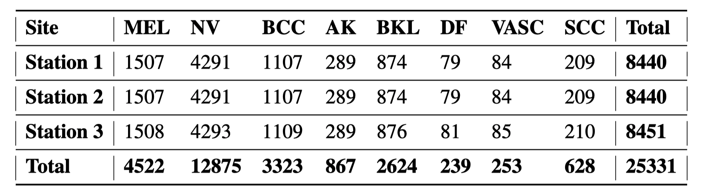
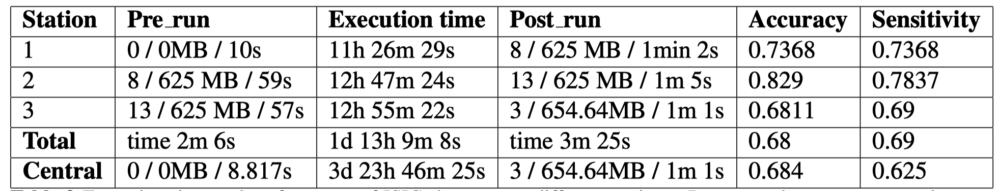
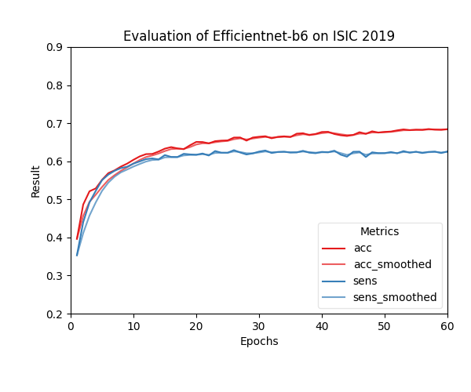
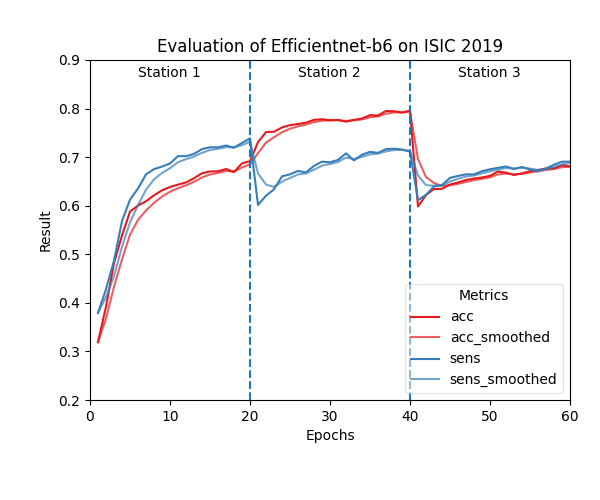

# Showcases

Showcases for the publication of the personal health train from Tübingen.

# NF-Core HLA-Typing
First showcase of paper. Task of the train ist to perform HLA-Typing on 216 NGS samples and perform two tasks:
1. Securely count the total number of HLA type `B*35:01` occurrences
2. Plot the absolute Top 15 HLA type occurrences over all stations.

## Scenario
### Description
Data from the [Human Genome project](https://doi.org/10.1038/nature11632) was downloaded on a server hosted at [deNBI Cloud](https://cloud.denbi.de/tubingen/) Tübingen.
On this instance three [stations](https://gitlab.com/PersonalHealthTrain/implementations/germanmii/difuture/station/station) were hosted. The data was mounted to the train by using the filesystem and the data was mapped to FHIR.
The fhir-mapping was performed with the code in repository described in section FHIR-mapping and fhir profiles were loaded on an [IBM FHIR-Server](https://ibm.github.io/FHIR/). The patients resources included a
reference to Media and synthetic personal information. Within the media resource a link to the corresponding file path was included
on the local server. If you want to recompute this scenario, please prepare the data on a station server with same or adapted mapping.

### Data
Data of 216 NGS subjects was downloaded from the 1000 Genome database. The link data downloader files downloads the provided subjects from download.csv
to the specified path using an ftp client. The output transformed.csv is generated and used for FHIR mapping.

#### FHIR-mapping
The code from the [repository fhir-mapping](https://gitlab.com/PersonalHealthTrain/implementations/germanmii/difuture/station/sandbox/fhir-station-mapping/-/blob/master/data_mapping/Patient_PHT.py) was used
to create valid FHIR profiles. These were uploaded to the [IBM FHIR-Server](https://ibm.github.io/FHIR/) used in this showcase.

### Master image
The Python master docker image ``nfdemo`` was built with this [dockerfile](https://gitlab.com/PersonalHealthTrain/implementations/germanmii/difuture/train-container-library/-/blob/master/docker_files/Dockerfile_nfcore) including the [nf-core/hlatyping](https://github.com/nf-core/hlatyping) pipeline and was uploaded to harbor.
The public available base image contains the train logic, [library](https://gitlab.com/PersonalHealthTrain/implementations/germanmii/difuture/train-container-library/-/blob/master/train_lib/train/NfcoreTrain.py) and dependencies of the algorithm. On this master image the algorithm file and query are stacked during the building process of the train.

### Train
The train algorithm ``nf-core/train/entrypoint.py`` was uploaded with the following FHIR query ``nf-core/train/query.json`` using the user interface.
The hash for manipulation detection was singed with the [offline tool](https://gitlab.com/PersonalHealthTrain/implementations/germanmii/difuture/pht-offline-tool).
A homomorphic encryption key was provided in the UI to perform `task 1` securely.

Side info: In this setup the FHIR Search Query was dynamically changing and excluded from manipulation checks setup the

### Execution
The deNBI Ubuntu 20.04.1 LTS cloud instance with 28 Intel(R) Xeon(R) Gold 6140 CPU @ 2.30GHz cores and 256GB memory 
required a total execution time of 44h and 49 min for the nf-core hlaytping train. The final results have a size of 22KB
and took below 1s at each station to decrypt and encrypt. 
The execution time stations specific was:

### Results
Encrypted results were downloaded using the UI. With the local installed offline-tool the decryption can be done.
The decrypted results are:

1. `24379966024370620994451437437625835596482603880750514638237371093577439182139` result can be decrypted by using the offline tool, and the homomorphic encrypted number reveals 24 occurrences.
2. The decrypted pdf is included in `nf-core/results/decrypted_task_2.pdf`

## ISIC-2019
The International Skin Imaging Collaboration (ISIC) 2019 is a dermoscopic image analysis benchmark challenge,
containing more than 25 thousand images of 8 different skin cancer types. The challenge’s goal is to support research and
development of algorithms for automated melanoma diagnoses by providing the data with an annotated ground truth by medical experts.
For demonstration purposes, we use the publicly available algorithm of the [2019 challenge champions](https://www.sciencedirect.com/science/article/pii/S2215016120300832).
In this showcase, we compare the performance of a central learned model with a distributed model.
## Scenario
### Description
The task of the analysis is to classify eight different types of skin cancer. We use all public available training images
and train an efficientnet-b6 Deep Neural Network (DNN). In the central analysis, we use the provided 5-Fold Cross-Validation (CV)
splits as the [challenges first place submission](https://www.sciencedirect.com/science/article/pii/S2215016120300832). In the distributed analysis, we also perform a 5-Fold CV at each
station locally using the identical fold splitting as within the central analysis setup. The distribution of data and
sample size for each class is shown in the table in section Data. The algorithm takes class in-balance into account by
weighting each class respectively to availability. Input data is analog mapped on FHIR and processed by the train as in the first showcase.

### Data
The [ISIC 2019 training data](https://challenge2019.isic-archive.com/data.html) was downloaded and accordingly to the distribution of the following table
saved at the station.

Distribution of data over three stations and total number of samples of each different class of skin lesions:
The central train was using the total number of images at one station.

#### FHIR-mapping
The exact path of the stored image on the deNBI server and ground truth of the subjects' cancer category are included in the FHIR profiles.
The files are stored again on an IBM FHIR server.

### Master image
The Python master docker image ``isic2019`` was built with this [dockerfile](https://gitlab.com/PersonalHealthTrain/implementations/germanmii/difuture/train-container-library/-/blob/demo/docker_files/Dockerfile_isic2019) including `pytorch`. It was uploaded to the public section in harbor.
The public available base image contains the train logic, [library](https://gitlab.com/PersonalHealthTrain/implementations/germanmii/difuture/train-container-library/-/blob/demo/train_lib/train/ISICTrain.py) and dependencies of the algorithm. On this master image the algorithm files and query are stacked during the building process of the train.

### Train

#### Central
The algorithm consist of multiple files and was uploaded as folder during the submission. The entrypoint `isic-2019/train/central_entrypoint.py` shall be selected during the submission process.
The hash was also signed with the offline tool.

#### Distributed
The algorithm consist of multiple files and was uploaded as folder during the submission. The entrypoint `isic-2019/train/entrypoint.py` shall be selected during the submission process.
The hash was also signed with the offline tool.

### Execution
The execution times of both trains is on a deNBI cloud Ubuntu 20.04.1 LTS instance with 2 Nvidia TeslaV100 GPUs,
16 Intel(R) Xeon(R) Gold 6140 vCPU @2.30GHz cores and 170GB memory are included in the following table.

Pre_run and post_run protocol are security protocol steps of the PHT and part of the train library.
Also, the number of files to consider, file size and execution time are reported.
The weighted accuracy and weighted sensitivity is averaged over all classes and reported from the last epoch at each station.

### Results
Two created plots of the training performance could be decrypted with the offline tool.

Central train performance:

Distributed train performance:

