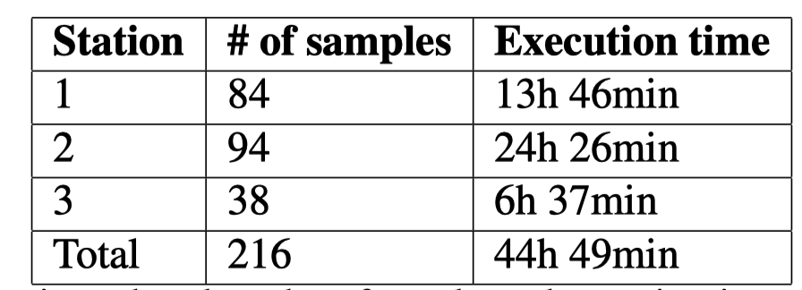

# Showcases

Showcases for the publication of the personal health train from Tübingen.

# NF-Core HLA-Typing
First showcase of paper. Task of the train ist to perform HLA-Typing on 216 NGS samples and perform two tasks:
1. Securely count the total number of HLA type `B*35:01` occurrences
2. Plot the absolute Top 15 HLA type occurrences over all stations.

## Scenario
### Description
Data from the [Human Genome project](https://doi.org/10.1038/nature11632) was downloaded on a server hosted at [deNBI Cloud](https://cloud.denbi.de/tubingen/) Tübingen.
On this instance three [stations](https://gitlab.com/PersonalHealthTrain/implementations/germanmii/difuture/station/station) were hosted. The data was mounted to the train by using the filesystem and the data was mapped to FHIR.
The fhir-mapping was performed with the code in repository described in section FHIR-mapping and fhir profiles were loaded on an [IBM FHIR-Server](https://ibm.github.io/FHIR/). The patients resources included a
reference to Media and synthetic personal information. Within the media resource a link to the corresponding file path was included
on the local server. If you want to recompute this scenario, please prepare the data on a station server with same or adapted mapping.

### Data
Data of 216 NGS subjects was downloaded from the 1000 Genome database. The link data downloader files downloads the provided subjects from download.csv
to the specified path using an ftp client. The output transformed.csv is generated and used for FHIR mapping.

#### FHIR-mapping
The code from the [repository fhir-mapping](https://gitlab.com/PersonalHealthTrain/implementations/germanmii/difuture/station/sandbox/fhir-station-mapping/-/blob/master/data_mapping/Patient_PHT.py) was used
to create valid FHIR profiles. These were uploaded to the [IBM FHIR-Server](https://ibm.github.io/FHIR/) used in this showcase.

### Master image
The Python master docker image ``nfdemo`` was built with this [dockerfile](https://gitlab.com/PersonalHealthTrain/implementations/germanmii/difuture/train-container-library/-/blob/master/docker_files/Dockerfile_nfcore) including the [nf-core/hlatyping](https://github.com/nf-core/hlatyping) pipeline and uploded to harbor.
The public available base images contain the train logic, [library](https://gitlab.com/PersonalHealthTrain/implementations/germanmii/difuture/train-container-library/-/blob/master/train_lib/train/NfcoreTrain.py) and dependecies of the algorithm. On this master image the algorithm and query are stacked during building of trains.

### Train
The train algorithm ``nf-core/train/entrypoint.py`` was uploaded with the following FHIR query ``nf-core/train/query.json`` using the user interface.
The hash for manipulation detection was signed with the [offline tool](https://gitlab.com/PersonalHealthTrain/implementations/germanmii/difuture/pht-offline-tool).
A homomorphic encryption key was provided in the UI to perform `task 1` securely.

Side info: In this setup the FHIR Search Query was dynamically changing and excluded from manipulation checks setup the

### Execution
The deNBI Ubuntu 20.04.1 LTS cloud instance with 28 Intel(R) Xeon(R) Gold 6140 CPU @ 2.30GHz cores and 256GB memory 
required a total execution time of 44h and 49 min for the nf-core hlaytping train. The final results have a size of 22KB
and took below 1s at each station to decrypt and encrypt. 
The execution time stations specific was:

### Results
Encrypted results were downloaded using the UI. With the local installed offline-tool the decryption can be done.
The decrypted results are:

1. `24379966024370620994451437437625835596482603880750514638237371093577439182139` result can be decrypted by using the offline tool, and the homomorphic encrypted number reveals 24 occurrences.
2. The decrypted pdf is included in `nf-core/results/decrypted_task_2.pdf`

## ISIC-2019

## Scenario
### Description

### Data

#### FHIR-mapping

### Master image

### Train

### Execution

### Results

